# Auto-Scaling, Multi-AZ Web Application with Disaster Recovery on AWS

---

## Problem Statement

A single EC2 instance running a web application creates three compounding risks that directly affect business continuity:

- **Single point of failure** — if the instance crashes or the Availability Zone becomes unavailable, the application goes down entirely with no fallback path
- **No elasticity** — a fixed instance cannot absorb traffic spikes, leading to degraded performance or outright failure at peak load, which directly translates to lost users
- **No recovery path** — without a documented, reproducible environment, restoring service after a catastrophic failure depends on manual effort and tribal knowledge, both of which are slow and error-prone

This project addresses all three by building a high-availability, automatically scaling, and recoverable web architecture on AWS — across two Availability Zones in the `ap-south-2` (Hyderabad) region.

---

## Solution Overview

Built a production-pattern AWS architecture where an Application Load Balancer distributes incoming HTTP traffic across two EC2 instances running Apache — each deployed in a separate Availability Zone. An Auto Scaling Group manages instance health and capacity automatically, scaling between a minimum of 1 and a maximum of 4 instances based on CPU utilization. A Custom AMI enables fast, reproducible environment rebuilds without manual configuration. An S3 bucket stores disaster recovery assets — website files, Apache configuration, and the bootstrap script — for full environment restoration when needed.

The result is an architecture that handles instance failure, AZ failure, and traffic spikes without manual intervention and without a dedicated operations team on standby.

---

## Architecture Diagram

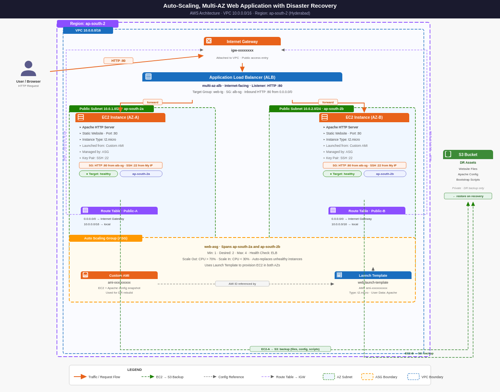

**Traffic Flow:**

1. User sends an HTTP request to the ALB DNS name
2. Request enters the VPC through the Internet Gateway
3. ALB receives the request and forwards it to a healthy EC2 instance in either `ap-south-2a` or `ap-south-2b` using round-robin distribution
4. EC2 serves the static web page via Apache HTTP Server on port 80
5. ALB performs health checks every 30 seconds — if an instance fails two consecutive checks, it is marked unhealthy and removed from rotation immediately, with no traffic disruption to the user
6. The ASG detects the unhealthy instance and launches a replacement automatically using the Custom AMI
7. DR assets stored in S3 allow full environment rebuild independent of any running instance

---

## AWS Services Used

| Service | Why It Was Used |
|---|---|
| **VPC** | Network isolation — defined a private boundary for all resources with a dedicated CIDR block |
| **Public Subnets (2 AZs)** | Multi-AZ availability — traffic continues serving if one AZ fails |
| **Internet Gateway** | Internet connectivity for the public subnets |
| **Route Table** | Routes external traffic (`0.0.0.0/0`) to the IGW correctly |
| **EC2 (t2.micro)** | Hosts the Apache web server — burstable instance type suited for variable web traffic |
| **Apache HTTP Server** | Serves static web content on port 80 |
| **Custom AMI** | Immutable, pre-configured image — eliminates manual setup on new instances, reduces launch-to-serve time |
| **Application Load Balancer** | Distributes traffic across EC2 instances in both AZs, performs health checks, handles failover routing |
| **Target Group** | Backend group the ALB routes traffic to, with configurable health check thresholds |
| **Auto Scaling Group** | Maintains desired capacity, replaces failed instances, scales based on CPU load |
| **Launch Template** | Single source of truth for instance configuration — ensures every instance launched by ASG is identical |
| **S3** | Durable, low-cost storage for DR assets — decouples recovery from instance availability |

---

## Implementation Steps

1. **Network** — Created a VPC (`10.0.0.0/16`) with two public subnets across `ap-south-2a` (`10.0.1.0/24`) and `ap-south-2b` (`10.0.2.0/24`). Attached an Internet Gateway and configured a Route Table with a `0.0.0.0/0 → IGW` route associated to both subnets. Enabled auto-assign public IPv4 on both subnets to ensure instances are reachable on launch.

2. **Compute** — Launched an EC2 instance (`t2.micro`, Amazon Linux 2023) in `ap-south-2a`. Installed and configured Apache HTTP Server via User Data script at boot — no manual SSH configuration required post-launch. Verified the web page loaded via the EC2 public IP before proceeding.

3. **AMI** — Created a Custom AMI from the fully configured EC2 instance. This image captures the OS, Apache installation, and web content as an immutable snapshot. Any instance launched from this AMI is production-ready without additional setup, which directly reduces the time between ASG detecting a failure and a replacement instance entering service.

4. **Load Balancing** — Created a Target Group (`web-tg`) with HTTP health checks on `/`. ALB health checks run every 30 seconds; an instance is marked unhealthy after 2 consecutive failures (60 seconds detection window) and immediately removed from traffic rotation. Created an internet-facing Application Load Balancer (`multi-az-alb`) spanning both public subnets, with a listener on HTTP `:80` forwarding to the target group.

5. **Auto Scaling** — Created a Launch Template referencing the Custom AMI. Created an Auto Scaling Group (`web-asg`) with Min: 1, Desired: 2, Max: 4, spanning both AZs. The ASG service itself carries no additional AWS cost — billing applies only to the EC2 instances it provisions. Scaling policy: target tracking on CPU utilization — scale out above 70%, scale in below 30%. The default 300-second cooldown period prevents rapid successive scaling actions from destabilizing the fleet.

6. **Disaster Recovery** — Created a private S3 bucket to store DR assets: `index.html`, `bootstrap.sh`, and Apache configuration files. S3 remains accessible even if all EC2 instances are terminated, making it a reliable recovery anchor that is independent of compute availability.

7. **Cleanup** — Deleted all resources in dependency order: ASG → ALB → Target Group → Launch Template → EC2 → AMI + Snapshot → VPC → S3.

---

## Screenshots

### 01 — VPC Created
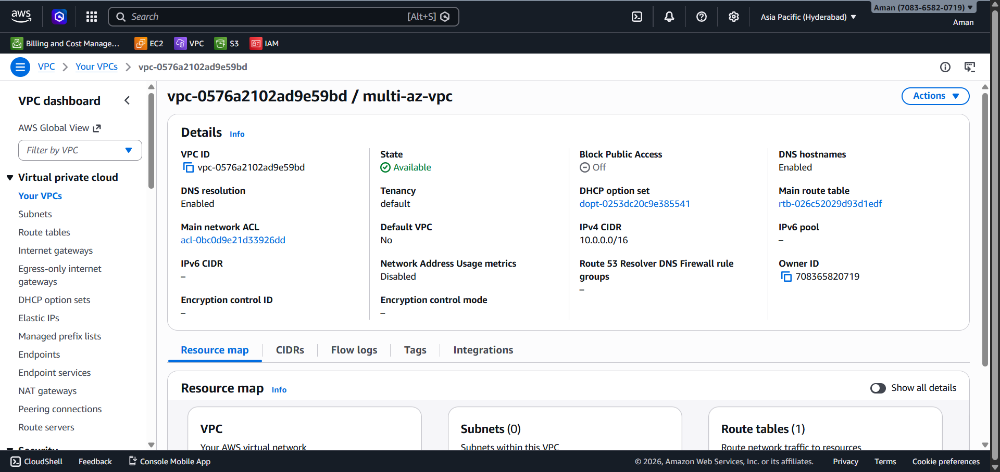

### 02 — Public Subnets (Multi-AZ)
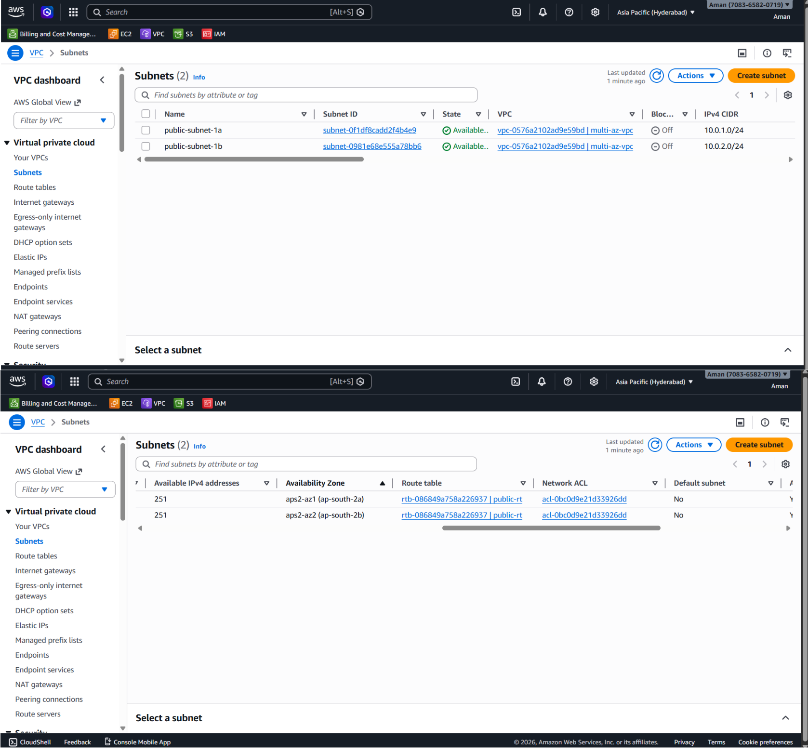

### 03 — Route Table + IGW
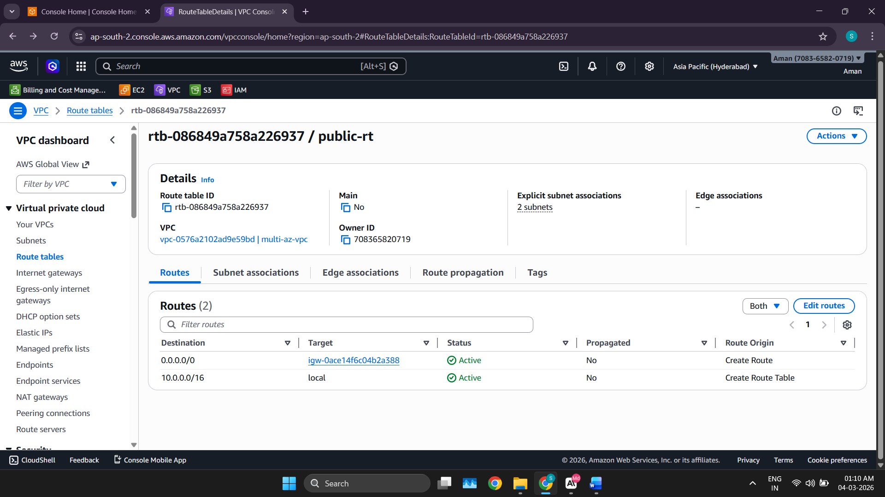

### 04 — EC2 Web Output (Initial)
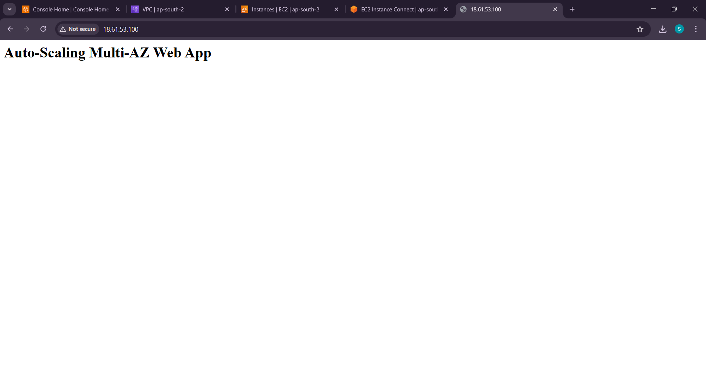

### 05 — Custom AMI Created
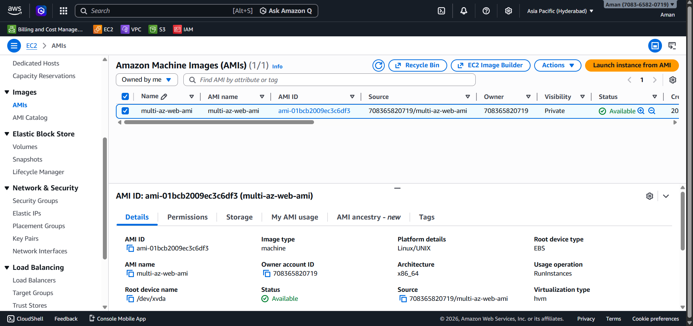

### 06 — Target Group Created
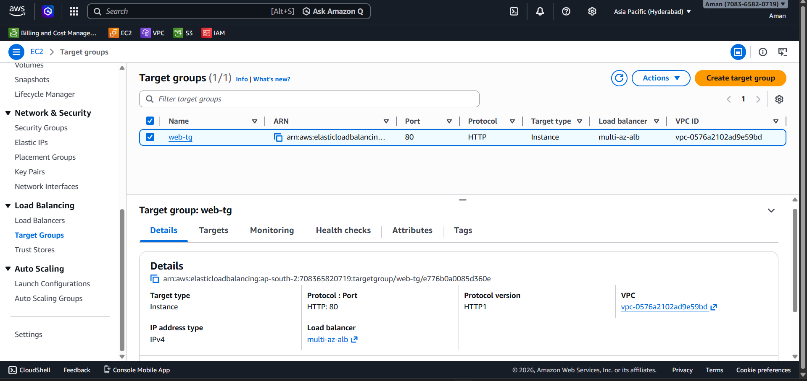

### 07 — ALB Created
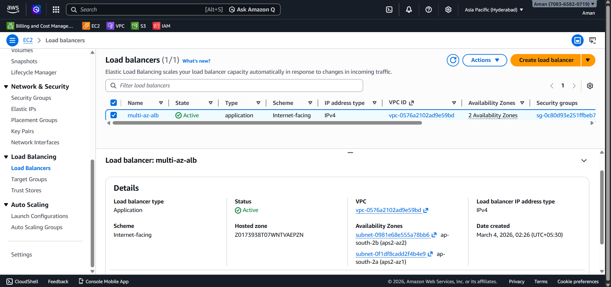

### 08 — Launch Template
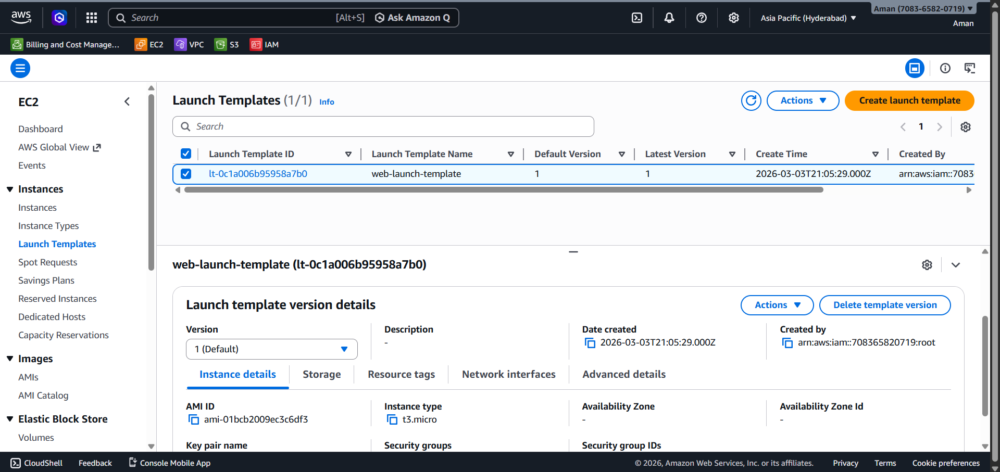

### 09 — ASG Configuration
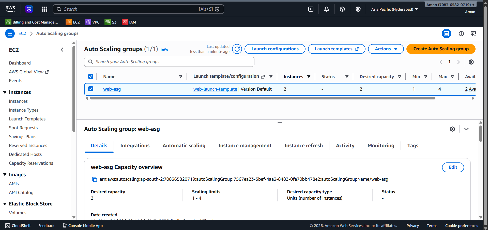

### 10 — EC2 Instances (Multi-AZ)
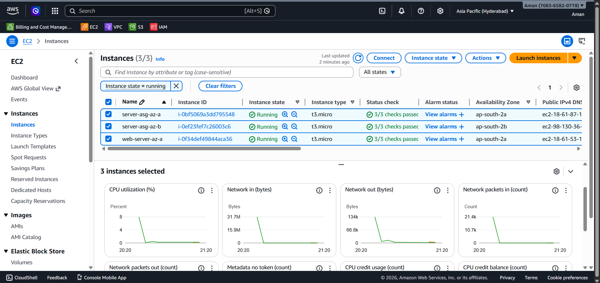

### 11 — Target Group Healthy
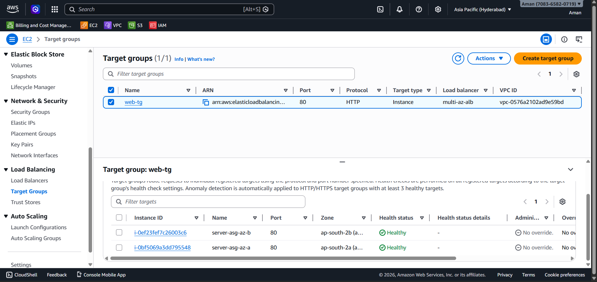

### 12 — ALB Web Output
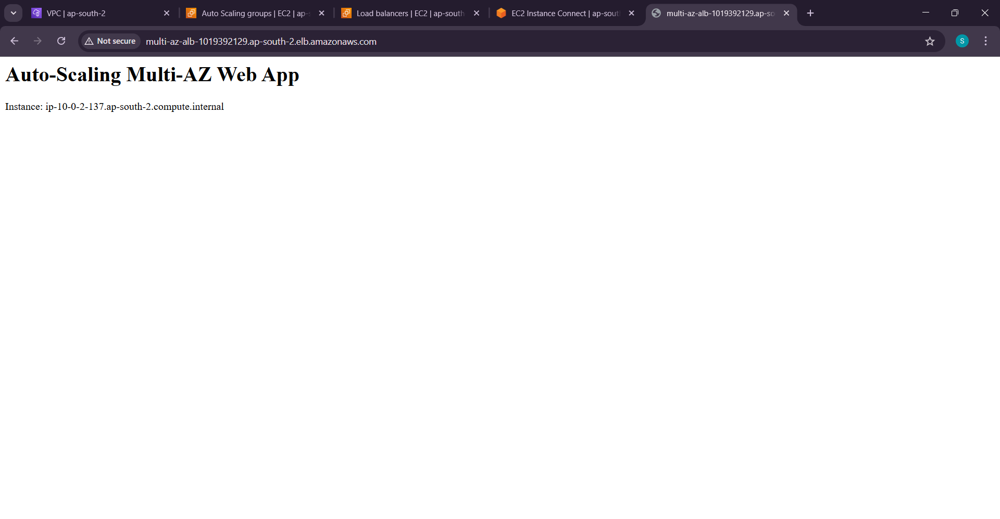

### 13 — ASG Scaling Activity
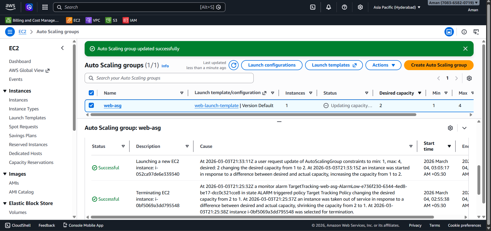

### 14 — S3 DR Assets
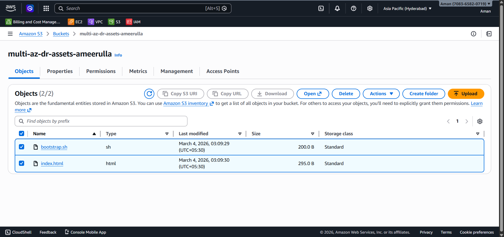

### 15 — Environment Cleanup
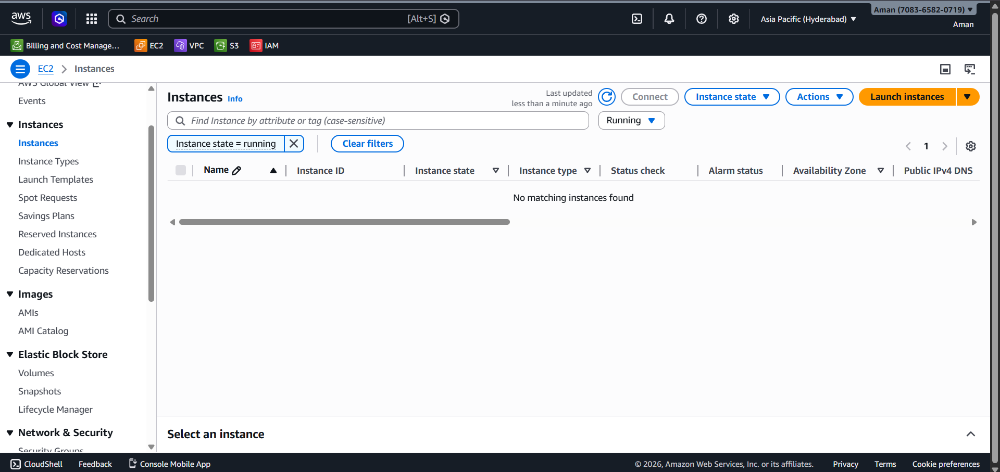

---

## Testing & Validation

**ALB Routing**
Accessed the ALB DNS name in a browser and refreshed multiple times. The hostname in the page response changed between refreshes, confirming the ALB was distributing traffic across both EC2 instances in `ap-south-2a` and `ap-south-2b` via round-robin.

**Auto Recovery**
Manually terminated one ASG-managed EC2 instance to simulate an instance failure. The ALB health check detected the missing target within its 30-second check interval and stopped routing traffic to it. The ASG launched a replacement instance automatically from the Custom AMI — no manual steps involved. Total observed time from instance termination to replacement entering service: approximately 90 seconds, confirmed in the ASG Activity History log.

**Health Check Behavior**
Target group health checks run on `/` over HTTP port 80 with the default 30-second interval and 2-failure unhealthy threshold. Both instances showed healthy status after initial registration. Post-recovery, the replacement instance passed its health check before the ALB began routing traffic to it, ensuring no user request was forwarded to an unready instance.

---

## Benefits

**High Availability**
EC2 instances are deployed across `ap-south-2a` and `ap-south-2b`. If one AZ experiences a failure, the ALB automatically routes all traffic to the healthy AZ. The ALB DNS record has a TTL of 60 seconds, meaning clients resolve to a healthy endpoint quickly. No manual intervention required at any point in the failover path.

**Fault Tolerance**
ALB health checks run every 30 seconds with a 2-failure unhealthy threshold — meaning an instance failure is detected within 60 seconds at most. The ASG replaces the instance automatically. From the user's perspective, traffic continues without interruption because the ALB stops forwarding requests to the failed target before the replacement launches.

**Automatic Scaling**
The ASG scales out when average CPU exceeds 70% and scales in when it drops below 30%. Without auto scaling, handling a traffic spike on a single fixed instance requires upfront over-provisioning — paying for compute capacity that sits idle during off-peak hours. Industry monitoring data shows EC2 instances provisioned statically commonly run at under 10–20% CPU utilization during low-traffic periods, representing direct cost waste. Dynamic scaling eliminates this by aligning capacity with actual demand.

**Disaster Recovery Capability**
The Custom AMI captures the full EC2 configuration — OS, Apache installation, and web content — as an immutable, versioned image. The S3 bucket stores the bootstrap script and configuration files independently of any running instance. If the entire environment is lost, it can be rebuilt from these two artifacts without recreating anything from scratch. S3 is designed for 99.999999999% (11 nines) data durability, making it a reliable foundation for a recovery strategy.

**Cost Control**
The ASG Min: 1, Desired: 2, Max: 4 configuration means the fleet only runs what it needs. During low-traffic periods, the ASG scales in rather than running fixed capacity. The ASG service itself carries no additional AWS cost — billing applies only to the EC2 instances it runs. Running a single unnecessary `t2.micro` instance 24/7 costs approximately $8–9 per month at On-Demand pricing. The same pattern of static over-provisioning at production scale, with larger instance types, becomes a significant and avoidable infrastructure expense. All resources in this project were terminated after testing, with no instances left running.

**Real-World Architecture Pattern**
This architecture directly mirrors the core infrastructure pattern used in production web deployments: isolated VPC, subnet-level AZ separation, internet-facing ALB with ELB health checks, ASG with immutable AMI-based deployment, and S3-backed disaster recovery. These components appear together in AWS Well-Architected Framework reviews under the Reliability and Cost Optimization pillars — this is not an academic exercise, it is a deployable pattern.

---

## Cost & Resource Management

This environment is not left running to avoid unnecessary cloud costs. It can be recreated using the documented architecture and AMI.

---

## Future Improvements

- **HTTPS via ACM** — Add an SSL/TLS certificate using AWS Certificate Manager and update the ALB listener to HTTPS `:443`. Currently, all traffic is unencrypted over HTTP, which is a security risk for any production workload handling user data.
- **Private Subnets + NAT Gateway** — Move EC2 instances to private subnets. Currently, instances carry public IPs, which expands the attack surface unnecessarily. Private subnets with a NAT Gateway allow outbound internet access while blocking direct inbound connections to instances.
- **CloudWatch Alarms + SNS** — Set up alarms on `UnHealthyHostCount` (ALB), CPU utilization (EC2), and `HTTPCode_ELB_5XX_Count` (ALB errors). Route alerts to an SNS topic. Currently the architecture heals automatically, but there is no visibility into when and how often healing events occur — which matters for reliability analysis and incident response.

---

## Conclusion

This project demonstrates a high-availability, fault-tolerant web architecture on AWS built across two Availability Zones in `ap-south-2` (Hyderabad). The architecture eliminates single points of failure at both the instance and AZ level, handles traffic elastically without over-provisioning, and provides a documented, reproducible disaster recovery path — without requiring manual intervention at any failure point.
